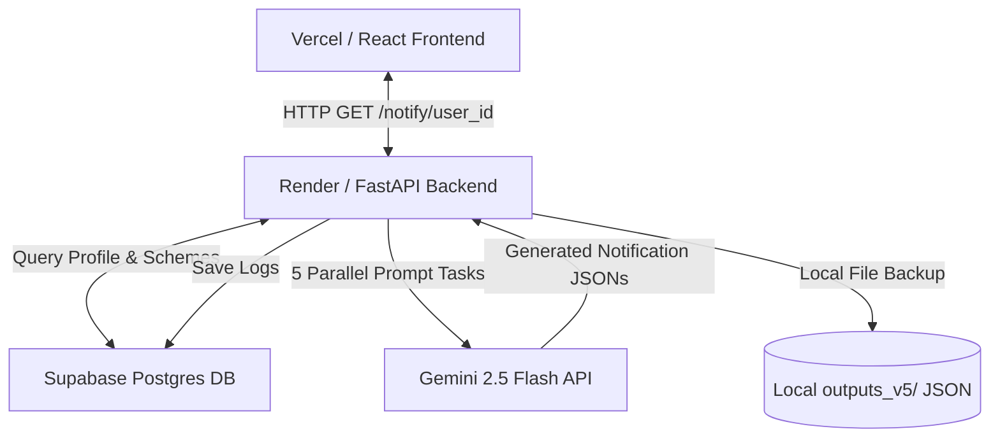
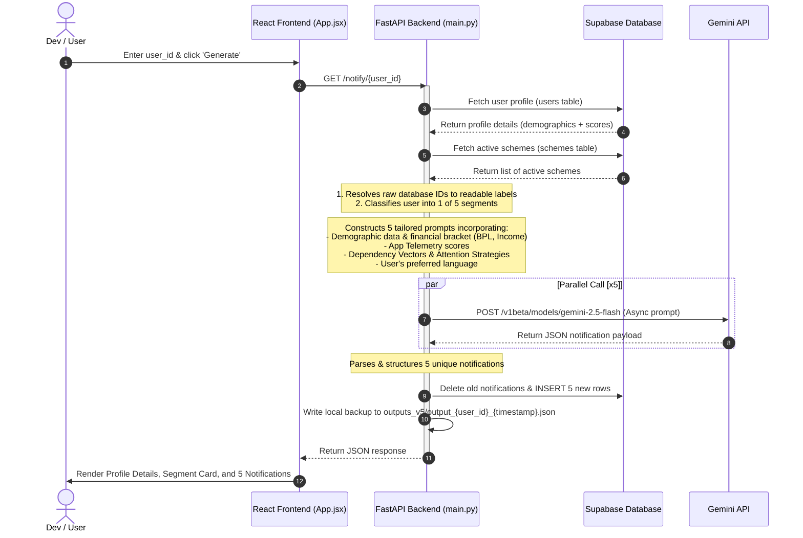

# Project Flow & Architecture Summary

This document provides a single-file overview of the **Zeex Hyper-Personalized Notification System (HPNS)** architecture, folder structure, step-by-step data flows, and file organization.

---

## 1. System Architecture Overview

The system uses a modern web stack to dynamically generate and display personalized notification copy tailored to specific citizen demographics and engagement behavior.



### Stack Components:
1. **Frontend**: Built with **React** + **Vite**, deployed on **Vercel**. Provides an interactive GUI to trigger notification runs and view real-time log aggregates on a dashboard.
2. **Backend**: Built with **FastAPI** + **httpx/asyncio**, deployed on **Render**. Performs customer segmentation logic and parallelizes requests to LLMs.
3. **Database**: **Supabase** (Postgres DB) storing citizen metadata, scoring features, scheme templates, and generated notifications.
4. **AI Inference**: **Gemini 2.5 Flash API** acting as the hyper-personalization engine.

---

## 2. Dynamic Data Flow

Here is the step-by-step lifecycle of generating notifications for a citizen:



---

## 3. Project File Flow & Folder Directory

The project is structured with backend APIs, frontend client code, offline pipeline scripts, and historical/backup assets:

```
Zeex-AMI-MVP/
├── backend/                         # FastAPI Application (Production API)
│   ├── main.py                      # Main backend logic: endpoints, segment classification, prompts, and async Gemini calls
│   ├── main_backup.py               # Previous iteration backup of main.py
│   └── requirements.txt             # Python dependencies for the backend
│
├── frontend/                        # React Frontend (Vite App)
│   ├── index.html                   # HTML Entry point
│   ├── package.json                 # Node package configuration and scripts
│   ├── vite.config.js               # Vite configurations (target dev ports, proxy)
│   └── src/
│       ├── main.jsx                 # React DOM mount point
│       ├── App.jsx                  # Main interface: state, generate handler, segment cards, and dashboard
│       └── index.css                # Global styling stylesheet (dark theme/glassmorphism)
│
├── mvp_v2/                          # MVP Version 2 (Legacy Code Reference)
│   └── mvp_v2/
│       ├── backend/                 # V2 Backend (main.py, requirements.txt)
│       ├── frontend/                # V2 Frontend (App.jsx, index.html, etc.)
│       └── supabase_schema.sql      # Supabase setup script defining user metadata, user scores, and notifications
│
├── files/                           # Backup files of key scripts
│   ├── App.jsx                      # Legacy/alternative React App
│   └── main.py                      # Legacy/alternative FastAPI backend
│
├── notify_pipeline_newest.py        # Offline Batch Pipeline v4: generates 5 notifications from local Excel/CSVs via Gemini
├── notify_newpipeline.py            # Offline Batch Pipeline v3: aggregates CSV logs and outputs text files
├── notify_pipeline.py               # Offline Batch Pipeline v2
└── README.md                        # Setup guides, Supabase SQL schema creation, deployment steps
```

---

## 4. Key Logic & Rules

### A. Segmentation Classification
The system groups users into **5 behavioral segments** based on their primary categories or calculated engagement metrics (`content_score`, `scheme_score`, `job_score`, `service_score`):
*   **Content Reader** (📄): High article views, long engagement. Focuses on awareness and discovery.
*   **High Converter** (🚀): High contact/enquiry clicks. Fast-tracked action calls.
*   **Job Hunter** (💼): High job option clicks. Skilling and income-focused.
*   **Scheme Seeker** (🏛️): Welfare match search. Clear eligibility checklists.
*   **Service Explorer** (🔧): Navigation clicks. Utility and public service updates.

### B. LLM Prompts & Guardrails
*   **Dependency Vector**: Decides financial positioning (e.g., *Dependent Aspirational* for low income but high aspiration; *Shared Household Distress* for low income/BPL).
*   **Attention Strategy**: Adapts messaging tone (e.g., *Fatigue Breakthrough* to prompt unresponsive users; *Swift Action Drive* for fast, concise actions).
*   **Language Adaptation**: Automatically translates and transliterates titles, bodies, and names to the user's preferred language (e.g. Hindi, Marathi, Telugu).
*   **Catchiness & Tone**: Direct instruction to write like a helpful friend (e.g., via WhatsApp/SMS) rather than a rigid government body.
